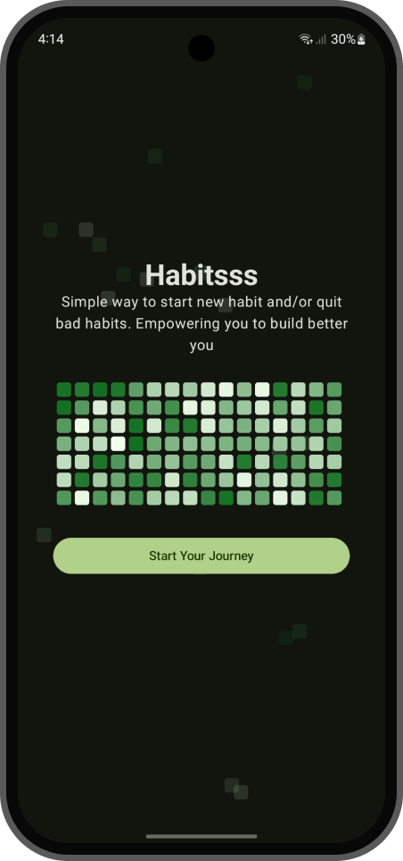
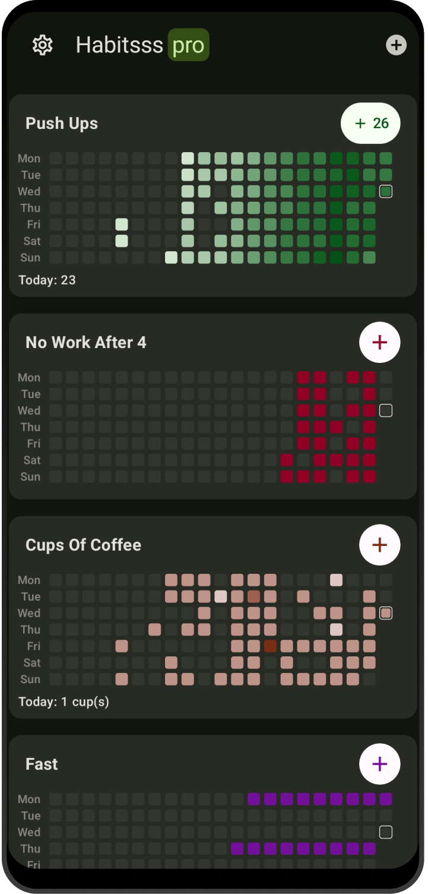
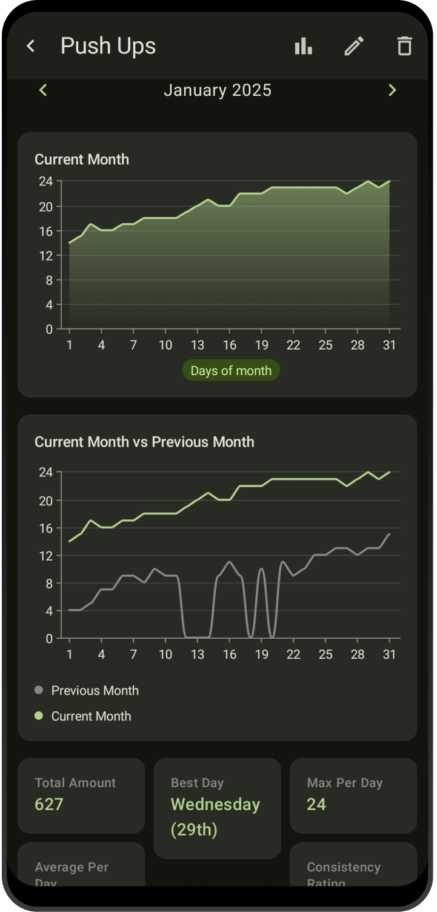

# Habitsss – Habit Tracker (Android)

  

[]

Habitsss is a modern, native Android habit tracking app focused on streaks, analytics, and long-term consistency.

Originally launched on Google Play in November 2024, Habitsss reached 350+ active users and included subscription-based features before the Play Store account was suspended due to new identity verification requirements.

The app is now distributed directly via GitHub Releases.

> This repository contains release builds and documentation only.  
> The source code remains private.

---

## 📥 Download

👉 **Download the latest APK**
- Minimum Android version: API 28+
- Architecture: Universal APK
- Signed release build
- 100% free to use

If you find issues, please open one in the **Issues** tab.

---

## ✨ Features
- ✅ Habit boards with customizable frequency tracking
- 📊 Rich analytics with streak tracking and visualizations
- 🔔 Smart reminder & notification system
- 📆 History log with custom date filtering
- 🧩 Modular architecture (built for long-term scalability)
- 🔒 Local-first data storage
- 🎯 Designed for long-term habit consistency

---

## 📸 Screenshots

| Onboarding | Home View | Habit View |
|:---:|:---:|:---:|
|  |  |  |

---

## 🏗 Architecture & Engineering Highlights

Habitsss was built as a production-grade application using:
- **Kotlin**
- **Jetpack Compose**
- **MVVM**
- **Multi-module architecture**
- **Custom Dependency injection method**
- **Room database**
- **GitHub Actions CI**
- Modular feature-based structure
- Clean separation between domain, data, and presentation layers

The project was designed to scale and potentially evolve into a Kotlin Multiplatform app.

---

## 📈 Product Journey
- Started development: November 2024
- Released on Google Play
- Reached 350+ users
- Implemented subscriptions & analytics
- Ran marketing experiments
- Collected real-world usage feedback

The app was removed from Google Play after new developer identity verification requirements required public physical address disclosure.

Rather than comply, I chose to distribute the app independently.

Habitsss remains fully functional and free.

---

## 🛣 Future

Habitsss may continue evolving in the future. Possible directions:
- Kotlin Multiplatform expansion
- Desktop support
- Advanced analytics
- Open-sourcing selected modules

For now, the focus is preservation and accessibility.

---

## 🐛 Issues & Feedback

If you encounter:
- Bugs
- UI issues
- Feature suggestions

Please open an issue.

Feedback is welcome.

---

## 📄 License

All rights reserved.  
The application is free to use, but the source code is not public.

