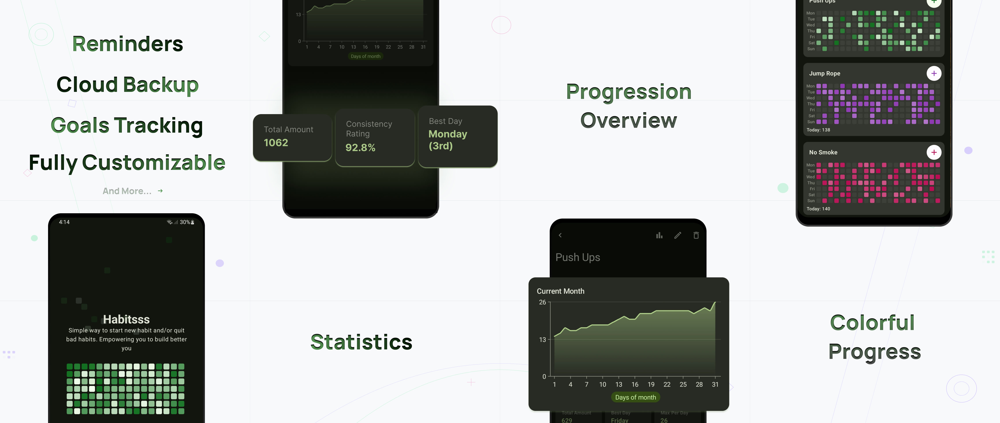

# Habitsss – Habit Tracker (Android)

  

  

Habitsss is a modern native Android habit tracker focused on streaks, analytics, and long-term consistency.

<!-- Originally launched on Google Play in November 2024, the app reached 350+ active users and included subscription-based features before the Play Store account was suspended due to updated identity verification requirements.

Habitsss is now distributed independently via GitHub Releases & 100% free to use. -->

> This repository contains release builds and documentation only.  
> The source code remains private.

---

## 📥 Download

👉 [**Download the latest APK**](../../releases/latest)

**Requirements**
- Minimum Android version: API 28+
- Architecture: Universal APK

If you find issues, please open one in the **Issues** tab.

**🔄 Stay Updated Automatically With Obtainium** (Recommended)

Obtainium is a free, open-source app that tracks GitHub releases and notifies you when updates are available.

- Install Obtainium from its [GitHub Releases](https://github.com/ImranR98/Obtainium/releases) page or from [IzzyOnDroid](https://apt.izzysoft.de/fdroid/index/apk/dev.imranr.obtainium).
- Open Obtainium and tap Add App.
- Paste this repository's URL and tap Add.
- Obtainium will track new releases and notify you when an update is ready.

---

## ✨ Features
- ✅ Habit boards with customizable frequency tracking
- 📊 Rich analytics with streak tracking and visualizations
- 🔔 Smart reminder & notification system
- 📆 History log with custom date filtering
- 🔖 NFC card support: tap a card to instantly log to any board
- 🧩 Modular architecture (built for long-term scalability)
- 🔒 Local-first data storage
- 🎯 Designed for long-term habit consistency

---

## Features Demo
<table>
  <tr>
    <td width="50%">
      
    </td>
    <td width="50%">
      <h3>Onboarding</h3>
        <ul>
          <li>Personalized onboarding questions to better understand user needs</li>
          <li>Guided step-by-step board creation for first-time users</li>
        </ul>
      <a href="./docs/demos/onboarding.md"><strong>🎥 Watch demo</strong></a>
    </td>
  </tr>
  <tr>
    <td width="50%">
      <h3>Boards</h3>
        <ul>
          <li>Switch between grid and list layouts on the home screen</li>
          <li>Reorder boards with drag and drop</li>
          <li>Archive boards for later access</li>
          <li>Log check-ins for today or for a specific date and time</li>
          <li>Add notes to your check-ins</li>
        </ul>
      <a href="./docs/demos/boards.md"><strong>🎥 Watch demo</strong></a>
    </td>
    <td width="50%">
      
    </td>
  </tr>
  <tr>
    <td width="50%">
      
    </td>
    <td width="50%">
      <h3>Board Editor</h3>
        <ul>
          <li>Edit board metadata: title and description</li>
          <li>Customize board color using presets or a color picker (color wheel, HEX, RGB)</li>
          <li>Configure custom unit with minimum check-in amount</li>
          <li>Advanced reminders management: add, edit, enable, disable, or remove</li>
        </ul>
      <a href="./docs/demos/board-editor.md"><strong>🎥 Watch demo</strong></a>
    </td>
  </tr>
  <tr>
    <td width="50%">
      <h3>📊 Analytics</h3>
        <ul>
          <li>Line chart showing current month progress</li>
          <li>Key statistics: best day, max per day, average per day, consistency, and more</li>
          <li>Current vs previous month comparison chart</li>
          <li>Interactive line chart with custom date range</li>
        </ul>
      <a href="./docs/demos/analytics.md"><strong>🎥 Watch demo</strong></a>
    </td>
    <td width="50%">
      
    </td>
  </tr>
  <tr>
    <td width="50%">
      
    </td>
    <td width="50%">
      <h3>Widget</h3>
        <ul>
          <li>View boards directly from the widget</li>
          <li>Add check-ins without opening the app</li>
          <li>Tap a board to open its dedicated screen</li>
          <li>Use the Home button to quickly launch the app</li>
        </ul>
      <a href="./docs/demos/widgets.md"><strong>🎥 Watch demo</strong></a>
    </td>
  </tr>
  <tr>
    <td width="50%">
      <h3>⚙️ Settings & Personalization</h3>
      <ul>
          <li>Customizable app accent color</li>
          <li>Theme support: Light, Dark, and AMOLED modes</li>
          <li>Archived boards management (restore or permanently delete)</li>
          <li>Data import and export capabilities</li>
          <li><b>Contact Support:</b> Opens email client with prefilled diagnostic information (user ID, device manufacturer, etc.)</li>
          <li><b>Send Debug Logs:</b> Export and attach application logs for troubleshooting</li>
      </ul>
      <a href="./docs/demos/settings.md"><strong>🎥 Watch demo</strong></a>
    </td>
    <td width="50%">
      
    </td>
  </tr>
</table>

---

## 🏗 Architecture & Engineering Highlights

Habitsss was built as a production-grade application using:
- **Kotlin**
- **Jetpack Compose**
- **MVVM**
- **Multi-module architecture**
- **Custom dependency injection method**
- **Room database**
- **GitHub Actions CI**
- Modular feature-based structure
- Clean separation between domain, data, and presentation layers

The project was designed to scale and potentially evolve into a Kotlin Multiplatform app.

---

## 📈 Product Journey
- Started development: November 2024
- Released on Google Play
- Reached 350+ users
- Implemented subscriptions & analytics
- Ran marketing experiments
- Collected real-world usage feedback

The app was removed from Google Play after new developer identity verification requirements required public physical address disclosure.

Rather than comply, I chose to distribute the app independently.

Habitsss remains fully functional and free.

---

## 🛣 Future

Habitsss may continue evolving in the future. Possible directions:
- Kotlin Multiplatform expansion
- Desktop support
- Advanced analytics
- Open-sourcing selected modules

For now, the focus is preservation and accessibility.

---

## 🐛 Issues & Feedback

If you encounter:
- Bugs
- UI issues
- Feature suggestions

Please open an issue.

Feedback is welcome.

---

## 📄 License

All rights reserved.  
The application is free to use, but the source code is not public.

