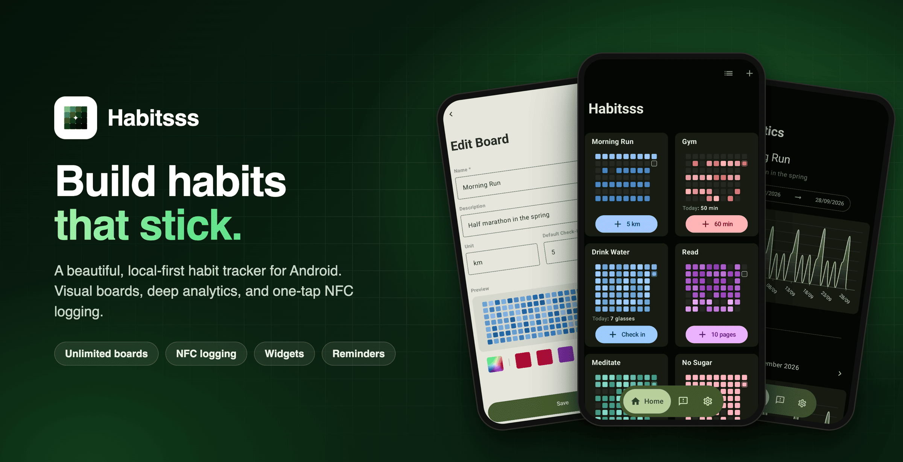
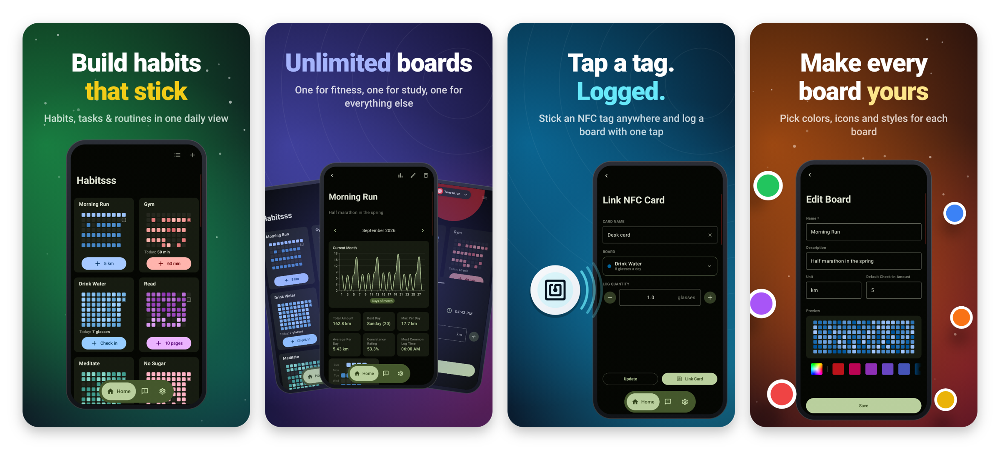
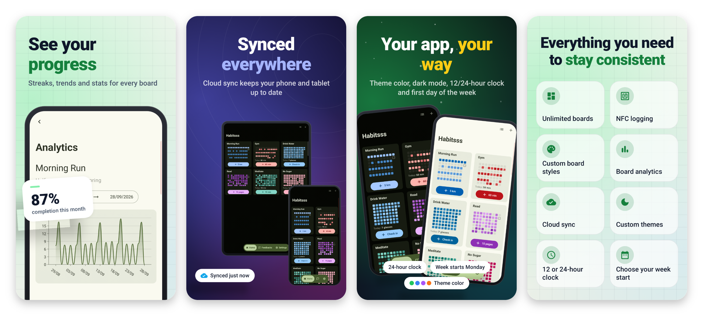
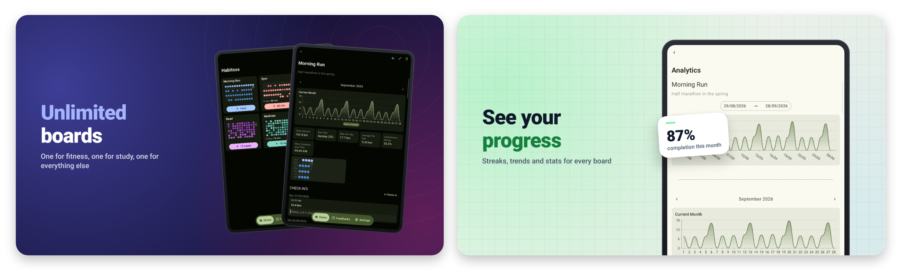

  

<h1 align="center">Habitsss – Habit Tracker (Android)</h1>

  

  
  
  
  

<!---->
<!---->
<!---->

  Habitsss is a modern native Android habit tracker focused on streaks, analytics, and long-term consistency.

  
  

## 💡 Why Habitsss?

- **🔒 Local-first, no account needed.** Your habits live on your device and work fully offline. Cloud sync is there if you want it.
- **🔖 Tap an NFC tag to log.** Stick a tag where the habit happens and check in with one tap. Few habit trackers can do this.
- **🆓 Free.** No ads, no paywalled features. Optional tips if you want to support development.

<!-- Originally launched on Google Play in November 2024, the app reached 350+ active users and included subscription-based features before the Play Store account was suspended due to updated identity verification requirements.

Habitsss is now distributed independently via GitHub Releases & 100% free to use. -->

> This repository contains release builds and documentation only.  
> The source code remains private.

---

## 📥 Download

### Google Play

### Direct APK

👉 [**Download the latest APK**](../../releases/latest)

**Requirements**
- Minimum Android version: API 28+
- Architecture: Universal APK

Found a bug? Report it from the **Feedbacks** tab in the app or on [Discord](https://discord.gg/TfSuvYjYAs).

**🔄 Stay Updated Automatically With Obtainium** (Recommended)

Obtainium is a free, open-source app that tracks GitHub releases and notifies you when updates are available.

- Install Obtainium from its [GitHub Releases](https://github.com/ImranR98/Obtainium/releases) page or from [IzzyOnDroid](https://apt.izzysoft.de/fdroid/index/apk/dev.imranr.obtainium).
- Open Obtainium and tap Add App.
- Paste this repository's URL and tap Add.
- Obtainium will track new releases and notify you when an update is ready.

---

## ✨ Features

<table>
  <tr>
    <td width="50%" valign="top">
      <h3>🟩 Habit boards</h3>
      <ul>
        <li>Unlimited boards with a heatmap of your progress</li>
        <li>Daily, weekly, or custom frequency</li>
        <li>Custom units and minimum check-in amounts (5 km, 8 glasses, 30 min)</li>
        <li>Log for today or backdate a check-in, with optional notes</li>
        <li>Grid or list layout, drag and drop to reorder, archive boards</li>
      </ul>
    </td>
    <td width="50%" valign="top">
      <h3>📊 Analytics</h3>
      <ul>
        <li>Current and best streak, consistency rating</li>
        <li>Monthly progress chart and month-over-month comparison</li>
        <li>Best day, max and average per day, most common log time</li>
        <li>Weekday patterns and custom date ranges</li>
      </ul>
    </td>
  </tr>
  <tr>
    <td width="50%" valign="top">
      <h3>🔖 NFC logging</h3>
      <ul>
        <li>Stick an NFC tag on your desk, water bottle, or gym bag</li>
        <li>Tap your phone to log a check-in instantly</li>
        <li>No need to open the app</li>
      </ul>
    </td>
    <td width="50%" valign="top">
      <h3>🔔 Reminders & widget</h3>
      <ul>
        <li>Multiple reminders per board, each editable or disabled on its own</li>
        <li>Notifications fire even when the app is closed</li>
        <li>Home screen widget to check in or open a board without opening the app</li>
      </ul>
    </td>
  </tr>
  <tr>
    <td width="50%" valign="top">
      <h3>🎨 Make it yours</h3>
      <ul>
        <li>Material 3 Expressive design</li>
        <li>Light, Dark, and AMOLED themes with a custom accent color</li>
        <li>Per-board colors from presets or a full color picker</li>
        <li>12 or 24-hour clock, choose your week start day</li>
      </ul>
    </td>
    <td width="50%" valign="top">
      <h3>☁️ Your data</h3>
      <ul>
        <li>Local-first: works fully offline, no account required</li>
        <li>Optional cloud backup and sync across phone and tablet</li>
        <li>Automatic local backup folder, plus import and export</li>
      </ul>
    </td>
  </tr>
</table>

---

## 📱 Tablet ready

  

---

## 🌍 Languages

Habitsss is available in **14 languages**, and you can switch language from inside the app:

| | | | |
|---|---|---|---|
| 🇬🇧 English | 🇸🇦 العربية (Arabic) | 🇦🇲 Հայերեն (Armenian) | 🇩🇪 Deutsch |
| 🇪🇸 Español | 🇫🇷 Français | 🇮🇳 हिन्दी (Hindi) | 🇮🇩 Bahasa Indonesia |
| 🇮🇹 Italiano | 🇯🇵 日本語 | 🇰🇷 한국어 | 🇧🇷 Português (Brasil) |
| 🇷🇺 Русский | 🇹🇷 Türkçe | | |

Spotted a bad translation? Let us know from the in-app **Feedbacks** tab or on [Discord](https://discord.gg/TfSuvYjYAs).

---

## ❓ FAQ

<b>Is Habitsss free?</b>

 
Yes. Every feature is free and there are no ads. The Google Play version has an optional tip in Settings if you'd like to support development.

<b>Where is my data stored?</b>

 
On your device. If you turn on cloud backup and sync, your data is also stored in your account (sign in with Google) so it can sync between your phone and tablet and be restored later.

<b>Does it work offline?</b>

 
Yes. Everything works without an internet connection. Only cloud sync needs one.

<b>Can I back up or move my data?</b>

 
Yes. Export your data to a JSON file and import it on another device, pick a local backup folder for automatic backups, or use cloud sync. Importing from other habit trackers isn't supported yet.

<b>Which Android version do I need?</b>

 
Android 9 (API 28) or newer. NFC logging needs a phone with NFC.

<b>Google Play or the GitHub APK?</b>

 
Same app either way. Google Play updates automatically; for the APK, use <a href="https://github.com/ImranR98/Obtainium">Obtainium</a> to get notified of new releases.

---

## 🔐 Privacy

- Your habit data is stored on your device. It only leaves it if you turn on cloud sync.
- Cloud sync is optional and uses Google sign-in; synced data is stored in Firebase.
- The app sends anonymous usage events (Firebase Analytics) and crash reports (Firebase Crashlytics) so bugs can be found and fixed.
- No ads.

Read the full [privacy policy](https://habitsss.mabd.dev/privacy-policy).

---

## ❤️ Support Habitsss

Habitsss is built by one developer. If it helps you, you can:

- ⭐ Star this repo
- ✍️ [Rate it on Google Play](https://play.google.com/store/apps/details?id=com.mabd.habittracker)
- 💚 Leave a tip from **Settings → Support Habitsss** in the Google Play version
- 🗣️ Tell a friend who's trying to build a habit

---

## 💬 Feedback & Bug Reports

- **In the app:** open the **Feedbacks** tab to report bugs, suggest features, and vote on ideas from other users. Powered by [Fedo](https://getfedo.com).
- **On Discord:** [join the community](https://discord.gg/TfSuvYjYAs) for questions, chat, and early news.

GitHub issues aren't monitored. Please use one of the options above.

---

## 📄 License

All rights reserved.  
The application is free to use, but the source code is not public.

